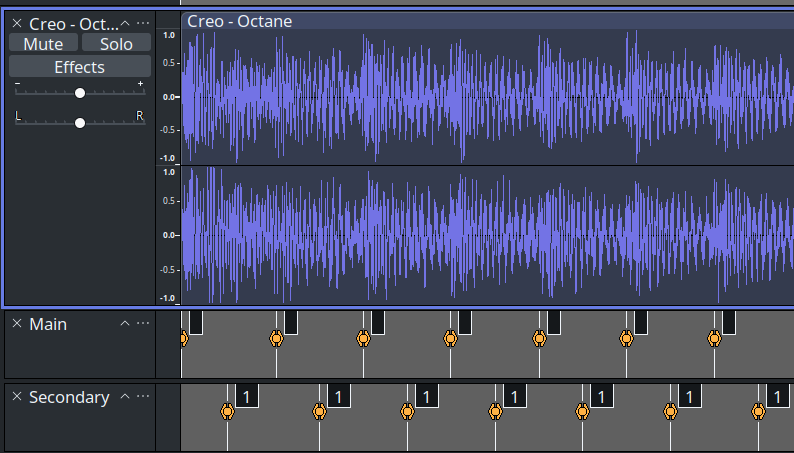
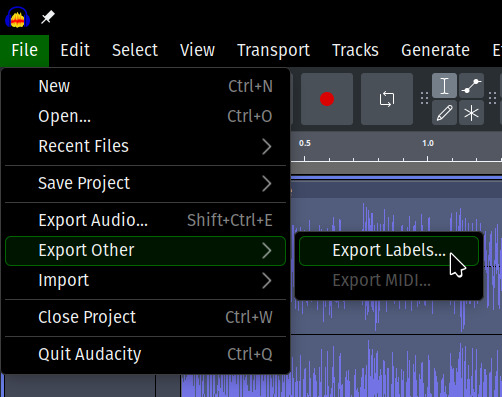

# Warning

It's possible that this program could corrupt save files (if GD's save format changes and my regexes match on something else or there's an edge case that I never tested). Keep a backup of your save file before using (although you should always have one).

# How to use

## Step 1
Open an mp3 from your data folder in Audacity and add labels where you want to see guidelines ingame:

## Step 2
Hit Ctrl-A to select all tracks and export the labels as a text file: \
 \
Select the file Audacity generates when you run the app.

The color is decided based on the name of the label (defaulting to 0 if there is no name or it isn't a number)
https://github.com/obj-obj/gd_audacity_guideline_importer/blob/8ef9b3e5994e112689c5915fbbae04c579b17535/src/main.rs#L225-L229
